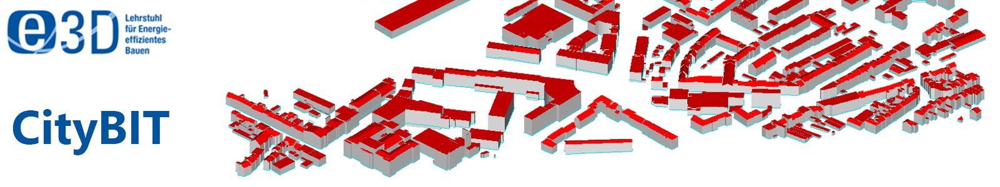

# CityBIT - CityGML Building Interpolation Tool 

The CityGML Building Interpolation Tool (CityBIT) is developed by members of the "Institute of Energy Efficiency and Sustainable Building (e3D), RWTH Aachen University" using Python 3.5+.
This tool can be used to interpolate building geometries for unavailable building models based on estmations and approximations.
The CityBIT aims to help urban planners and simulation scientists to facilitate CityGML model developments for energy performance simulations.

This GitLab page will be used to further develop the package and make it available under the [MIT License](https://gitlab.e3d.rwth-aachen.de/e3d-software-tools/citybit/citybit/-/blob/master/License/LICENSE).

If you have any questions regarding CityBIT feel free to contact us at: [malhotra@e3d.rwth-aachen.de](mailto:malhotra@e3d.rwth-aachen.de)

## Description

Emerging technologies, computational algorithms and simulation environments enable users, facility managers and occupants to achieve a good estimation of the energy demands of their buildings, districts and cities.
This is a huge step forward towards the realization of the 7th United Nations Sustainable Goal of ensuring an affordable, reliable, sustainable and modern energy for the population of our planet.
The availability of 3D building models has been increasing in the last few years. CityGML LoD1-2 datasets are also available for some countries, states and cities. However, there is still a lack of open source information for many city districts which would be beneficial for the industrial and research community. In order to bridge the gap between the availability of data models and its application, CityBIT can be used to create missing building models where less or no data exists. 

## Version

The CityBIT is currently being developed. Currently the CityBIT is available in the version 0.1.

## How to use CityBIT

### Dependencies

CityBIT is currently being developed using Python 3.5+ and PySide2 python bindings. However in future, the developers will make it usable with other versions of python 3. 
Futhermore, the following external libraries/python packages are used in the different functionalities of CityBIT:
1. Pyside2
2. numpy
3. sys
4. csv
5. lxml

### Installation

The CityBIT can be used by cloning or downloading the whole CityBIT package from the GIT Repository. Moreover, the user needs to run the "main.py" for loading the GUI.  

### How to contribute to the development of CityBIT

You are invited to contribute to the development of CityBIT. You may report any issues by using the [Issues](https://gitlab.e3d.rwth-aachen.de/e3d-software-tools/citybit/citybit/-/issues) button.

## How to cite CityBIT

To be made available soon.

## License

CityBIT is released by RWTH Aachen University, E3D - Institute of Energy Efficiency and Sustainable Building, under the [MIT License](https://gitlab.e3d.rwth-aachen.de/e3d-software-tools/citybit/citybit/-/blob/master/License/LICENSE).
